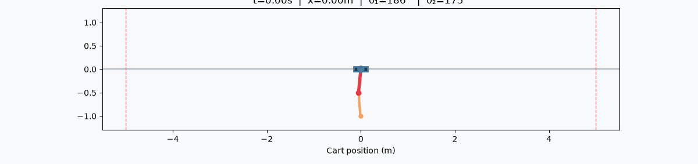

# n-cartpole

[](https://github.com/Tsmorz/n-cartpole/actions/workflows/ci.yml)
[](https://www.python.org/)
[](LICENSE)

PPO policy learning for double pendulum cartpole swing-up. A cart on a frictionless track carries two pendulums in series; the policy learns to apply horizontal forces to swing both poles from hanging to upright and balance them there.



## Install

```bash
# requires uv and go-task
task init
```

## Quickstart

```bash
# PPO (on-policy): parallel CPU workers, CPU gradient update
task train

# TQC (off-policy, distributional): sample-efficient, hardware-oriented
task train-tqc -- --steps 300000

# override any hyperparameter, e.g. more workers / longer rollouts
task train -- --workers 8 --steps 2048 --iterations 300

# watch a trained policy — interactive HTML replay (auto-detects PPO vs TQC)
task play -- --checkpoint checkpoints/latest.pt
task play -- --checkpoint checkpoints/tqc_latest.pt

# interactive training dashboard (return + PPO diagnostics) from metrics.csv
task plot

# the policy's input→output map: force (and value) over two state dims + slider
task policy-map -- --x theta1 --y theta1dot --slider theta2
```

**Visualization.** Every view renders to a self-contained, interactive **Plotly**
HTML page (hover, zoom, play/scrub) — no static PNGs. `task play` gives a scrub-able
cart-and-poles replay with a synced telemetry sidebar (uprightness, cart position,
applied force, per-step reward). `task policy-map` turns the trained MLP into a
readable control surface — a contour phase-portrait of the force the policy applies
across a plane of states (blue = push right, red = push left), with a slider over a
third dimension. `task plot` renders the training curves as small multiples.

**Two learners.** PPO is the simple on-policy baseline. **TQC** (Truncated Quantile
Critics) is the off-policy, distributional actor-critic that Lee et al. used for
real multi-pendulum hardware — far more sample-efficient. Both share the
environment, the bounded reward, symmetric data augmentation, and the diverse
initial-state distribution described below.

> **Device note:** the networks are small (8→64→64 MLPs), so the whole run is
> fastest on CPU — GPU per-op dispatch overhead outweighs the tiny matmuls, and
> the GAE step is dramatically slower on MPS. `--device auto` therefore selects
> CPU. Use `--device mps`/`--device cuda` only after substantially enlarging the
> network.

## Development

| Command | Description |
|---|---|
| `task init` | Create virtual environment and install deps |
| `task train` | Train the PPO policy (default settings) |
| `task play` | Interactive HTML replay of a trained policy |
| `task plot` | Interactive training dashboard from `metrics.csv` |
| `task policy-map` | Interactive input→output (force/value) control-surface map |
| `task test` | Run tests with coverage |
| `task format` | Ruff format + lint + mypy |
| `task ci` | Full local CI (format + test) |
| `task clean` | Remove venv, caches, checkpoints |

## System

- **Dynamics**: Lagrangian EOM for cart + 2 pendulums (point-mass bobs) with viscous cart/joint friction; RK45 at **100 Hz**. Buildable bench-scale defaults: 1 kg cart, ~0.2/0.15 kg bobs, 0.25 m rods, ±0.5 m rail, ±20 N motor.
- **Reward**: bounded, multiplicative shaping in (0, 1] — `r_angle · r_pos · r_vel · r_act` (Lee et al.). Product over links forces *both* poles upright; the velocity term rewards balancing over spinning; always-positive returns stay well-scaled.
- **Learners**: **PPO** (on-policy, GAE λ=0.95, ε=0.2, return-normalized value loss, KL early-stop) and **TQC** (off-policy, 2 quantile critics × 25 atoms with top-drop truncation, SAC-style auto-entropy, replay buffer).
- **Sample efficiency**: left-right **symmetry augmentation** (mirror every transition) and a **diverse initial-state distribution** (30% fully-random resets for recovery from any configuration).
- **Observation**: `[x, ẋ, cos θ₁, sin θ₁, θ̇₁, cos θ₂, sin θ₂, θ̇₂]` — cos/sin encoding eliminates angle discontinuities.
