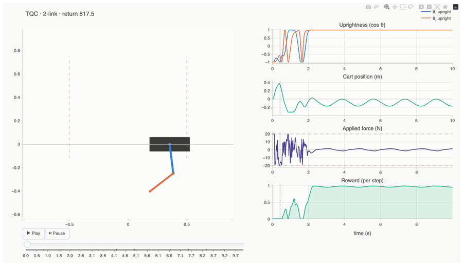

# n-cartpole

[](https://github.com/Tsmorz/n-cartpole/actions/workflows/ci.yml)
[](https://www.python.org/)
[](LICENSE)

PPO and TQC policy learning for double pendulum cartpole swing-up. A cart on a frictionless track carries two pendulums in series; the policy learns to apply horizontal forces to swing both poles from hanging to upright and balance them there.



*A trained TQC policy swinging up and balancing both links upright, cart re-centered — return 817.5 over the episode.*

## Install

```bash
# requires uv and go-task
task init
```

## Quickstart

```bash
# PPO (on-policy): parallel CPU workers, CPU gradient update — defaults to 2 links (double)
task train

# single-link warm-up run, or explicit double-link
task train -- --links 1
task train -- --links 2

# TQC (off-policy, distributional): sample-efficient, hardware-oriented
task train-tqc -- --links 2 --steps 300000

# override any hyperparameter, e.g. more workers / longer rollouts
task train -- --workers 8 --steps 2048 --iterations 300

# watch a trained policy — interactive HTML replay (auto-detects PPO/TQC and link count)
task play -- --checkpoint checkpoints/double/ppo/ppo_latest.pt
task play -- --checkpoint checkpoints/double/tqc/tqc_latest.pt
task play -- --checkpoint checkpoints/single/ppo/ppo_latest.pt

# interactive training dashboard (return + PPO diagnostics) from metrics.csv
# (auto-detects the most recently trained run; or point at one explicitly)
task plot -- --csv checkpoints/double/ppo/metrics.csv

# the policy's input→output map: force (and value) over two state dims + slider
task policy-map -- --checkpoint checkpoints/double/ppo/ppo_latest.pt --x theta1 --y theta1dot --slider theta2
```

**Checkpoint layout.** Checkpoints are organized `checkpoints/<single|double>/<ppo|tqc>/`,
so the folder alone tells you the link count and the folder + filename prefix tell you
the algorithm — e.g. `checkpoints/double/tqc/tqc_latest.pt`. Within each folder:
`{ppo,tqc}_latest.pt` (rolling best/most-recent), `ppo_iter_NNNNN.pt` /
`tqc_NNNNNNN.pt` (periodic snapshots by iteration/step), and PPO also writes
`returns.csv` / `metrics.csv` there for `task plot`. `task play` and
`task policy-map` auto-detect algorithm and link count from the checkpoint
itself (via the saved `TrainingConfig`/`TQCConfig`), so any checkpoint path
works regardless of which folder it lives in.

**Pretrained models.** `checkpoints/` is gitignored (binary, environment-specific,
trivially reproducible) — pretrained weights are published as
[GitHub Releases](https://github.com/Tsmorz/n-cartpole/releases) instead, each
release carrying up to four zips (`single-ppo.zip`, `single-tqc.zip`,
`double-ppo.zip`, `double-tqc.zip`), one per link-count/algorithm combination
you've trained locally. Nothing trains in CI — releases are built and published
entirely from your machine. Fetch and unpack the latest release into
`checkpoints/` with:

```bash
task download-models                 # latest release
task download-models -- models-v1    # a specific tag
```

To cut a new release: train locally as usual, then run

```bash
task release-models -- models-v1
```

which zips whatever's under `checkpoints/<single|double>/<ppo|tqc>/`
(`task package-models` alone, if you just want the zips without
tagging/publishing), tags and pushes `models-v1`, and creates the GitHub
Release — only the combinations you actually trained are included.

The last step requires the [GitHub CLI](https://cli.github.com/) (`gh auth login`).
Without it, do the first two steps manually and upload via the web UI:

```bash
task package-models              # produces dist/*.zip
git tag models-v1
git push origin models-v1
# then go to github.com/Tsmorz/n-cartpole/releases/new, pick the tag, and attach dist/*.zip
```

**Visualization.** Every view renders to a self-contained, interactive **Plotly**
HTML page (hover, zoom, play/scrub) — no static PNGs. `task play` gives a scrub-able
cart-and-poles replay with a synced telemetry sidebar (uprightness, cart position,
applied force, per-step reward). `task policy-map` turns the trained MLP into a
readable control surface — a contour phase-portrait of the force the policy applies
across a plane of states (blue = push right, red = push left), with a slider over a
third dimension. `task plot` renders the training curves as small multiples.

**Two learners.** PPO is the simple on-policy baseline. **TQC** (Truncated Quantile
Critics) is the off-policy, distributional actor-critic that Lee et al. used for
real multi-pendulum hardware — far more sample-efficient (demo above uses a TQC
checkpoint: `task play -- --checkpoint checkpoints/double/tqc/tqc_latest.pt`).
Both share the environment, the bounded reward, symmetric data augmentation,
and the diverse initial-state distribution described below.

> **Device note:** the networks are small (8→64→64 MLPs), so the whole run is
> fastest on CPU — GPU per-op dispatch overhead outweighs the tiny matmuls, and
> the GAE step is dramatically slower on MPS. `--device auto` therefore selects
> CPU. Use `--device mps`/`--device cuda` only after substantially enlarging the
> network.

## Development

| Command | Description |
|---|---|
| `task init` | Create virtual environment and install deps |
| `task train` | Train the PPO policy (default settings, `--links {1,2}`) |
| `task train-tqc` | Train the TQC policy (`--links {1,2}`) |
| `task play` | Interactive HTML replay of a trained policy |
| `task download-models` | Download a models release into `checkpoints/` |
| `task package-models` | Zip local checkpoints into `dist/` |
| `task release-models` | Package, tag, and publish local checkpoints as a GitHub Release |
| `task plot` | Interactive training dashboard from `metrics.csv` |
| `task policy-map` | Interactive input→output (force/value) control-surface map |
| `task test` | Run tests with coverage |
| `task format` | Ruff format + lint + mypy |
| `task ci` | Full local CI (format + test) |
| `task clean` | Remove venv, caches, checkpoints |

## System

- **Dynamics**: Lagrangian EOM for cart + 2 pendulums (point-mass bobs) with viscous cart/joint friction; RK45 at **100 Hz**. Buildable bench-scale defaults: 1 kg cart, ~0.2/0.15 kg bobs, 0.25 m rods, ±0.5 m rail, ±20 N motor.
- **Reward**: bounded, multiplicative shaping — `r_angle · r_pos · r_vel · r_act` (Lee et al. [2, 3]), nearly always in (0, 1]. Product over links forces *both* poles upright; the velocity term rewards balancing over spinning. On top of that, a potential-based shaping term (Ng et al. [1]) rewards progress toward upright every step, so swing-up is discovered sooner — see [Appendix: papers](#appendix-papers) below.
- **Learners**: **PPO** (on-policy, GAE λ=0.95, ε=0.2, return-normalized value loss, KL early-stop) and **TQC** (off-policy, 2 quantile critics × 25 atoms with top-drop truncation, SAC-style auto-entropy, replay buffer).
- **Sample efficiency**: left-right **symmetry augmentation** (mirror every transition) and a **diverse initial-state distribution** (30% fully-random resets for recovery from any configuration).
- **Observation**: `[x, ẋ, cos θ₁, sin θ₁, θ̇₁, cos θ₂, sin θ₂, θ̇₂]` — cos/sin encoding eliminates angle discontinuities.

## Appendix: papers

Design choices in this repo that come from published research, cited where used above:

1. A. Y. Ng, D. Harada, and S. Russell, "Policy Invariance Under Reward
   Transformations: Theory and Application to Reward Shaping," in *Proc. 16th
   International Conference on Machine Learning (ICML)*, 1999. — Source of the
   potential-based reward shaping term (`F(s,s') = γ·Φ(s') − Φ(s)`) added to the
   base reward in `n_cartpole/env/double_cartpole.py` / `single_cartpole.py`,
   to make swing-up progress rewarding sooner without changing the optimal
   policy.
2. T. Lee, D. Ju, and Y. S. Lee, "Transition Control of a Double-Inverted
   Pendulum System Using Sim2Real Reinforcement Learning," *Machines*, vol. 13,
   no. 3, p. 186, 2025. https://doi.org/10.3390/machines13030186 — PDF at
   `docs/machines-13-00186.pdf`. Source of the bounded, multiplicative reward
   structure (product of per-objective terms in [0, 1]) and the "recovery
   characteristics" diverse initial-state distribution.
3. Y. Oh, T. Lee, S. Ryoo, K. C. Koh, S. Han, and Y. S. Lee, "Reinforcement
   Learning to Achieve Real-time Control of a Quadruple Inverted Pendulum,"
   *International Journal of Control, Automation, and Systems*, vol. 23, no. 9,
   pp. 2797-2806, 2025. https://doi.org/10.1007/s12555-025-0235-y — PDF at
   `docs/s12555-025-0235-y.pdf`. Source of the TQC (Truncated Quantile Critics)
   learner and Virtual Experience Replay (VER), the left-right mirror-symmetry
   data augmentation used during off-policy training.
